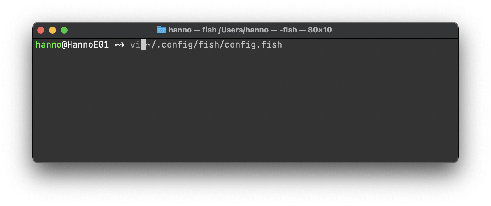
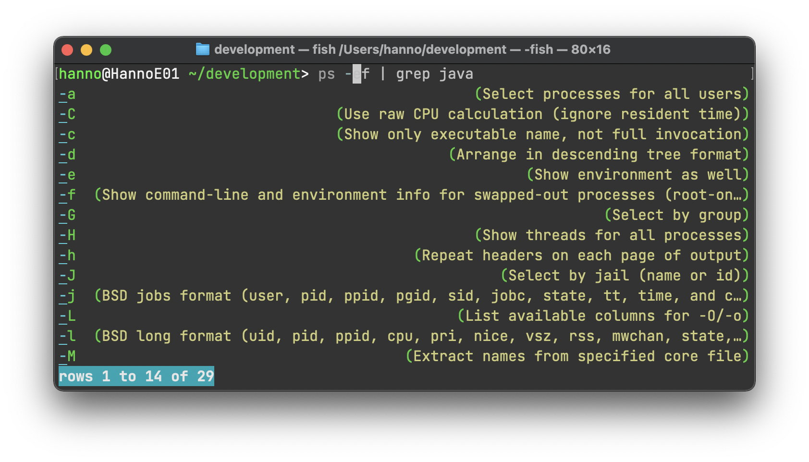
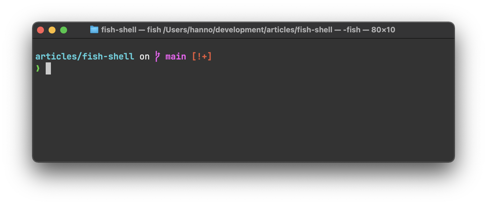

# Voel je als een vis in het water met de fish-shell

Het eerste dat ik installeer op een nieuwe laptop? 
De *fish*-shell. 
Je went enorm snel aan handige features als suggesties uit je shellhistorie, tab completion op o.a. Git-commando's en syntax highlighting. 
Ook de web-based configuratie is erg gebruiksvriendelijk!

## Fish?

'Fish' staat voor **F**riendly **I**nteractive **SH**ell en is een command-line shell die zich voornamelijk richt op gebruiksvriendelijkheid, waarbij de expressiviteit niet in het geding mag zijn.
Een ander belangrijk ontwerpprincipe is dat in fish alles mogelijk moet zijn wat ook in andere *shells* mogelijk is.
De belangrijkste features van fish bespreek ik in dit artikel.

## Automatische suggesties

Terwijl je aan het typen bent, suggereert fish commando's rechts van je cursor.
De shell put hiervoor uit bestaande bestandspaden en uit je shellhistorie.
Handig voor als je een lang commando opnieuw nodig hebt.

Met `→` of `Ctrl + F` kun je de suggestie die fish doet accepteren. 
Met `Alt + →` accepteer je de suggestie per woord. 
Of je kunt gewoon verder typen om de suggestie die gedaan is te negeren. 

## Tab completion

Als je in fish expliciet op `Tab` drukt, toont fish de mogelijke commando's (of commando-opties, wanneer je al een commando hebt staan) in een lijst. 
Deze lijst genereert fish automatisch door de geïnstalleerde *man pages* van tevoren te parsen.
Met de pijltjestoetsen kun je door de lijst heen lopen.
Zo vind je snel het commando of de commando-optie die je nodig hebt.

Dit is voor de makers van fish een belangrijke feature, omdat één van hun doelen is om nieuwe gebruikers snel experts te laten worden. 
En een belangrijk criterium voor de snelheid van dat proces is *discoverability*: de mate waarin een nieuwe gebruiker de mogelijkheden van een softwareprogramma zelf kan ontdekkken.
Bij een programma met een grafische interface is de *discoverability* vaak hoog, omdat de mogelijkheden direct zichtbaar zijn in de interface.
Bij een command-line interface is de *discoverability* een stuk lager, omdat de mogelijkheden verstopt zitten in de *man pages*, en die moet je als gebruiker zelf weten te vinden om een expert te worden.
Door de *man pages* aan te bieden via *tab completion* krijgen nieuwe gebruikers in een kortere hoeveelheid tijd meer mogelijkheden te zien, wat de gebruiker helpt in het proces om expert in het product te worden.

## Syntax highlighting

Fish geeft ongeldige commando's of niet-bestaande bestandslocaties standaard in rode tekst weer. 
Een geldig commando heeft standaard groene tekst, terwijl een geldige bestandslocatie altijd wordt onderstreept. 

## Web-based configuratie

De opmaak die fish standaard gebruikt voor de *syntax highlighting* is uiteraard te wijzigen.
Hiertoe kun je het commando `fish_config` uitvoeren. 
Je krijgt dan een web-interface te zien waarmee je naast opmaak ook functies en aliassen in kunt stellen.
Na het wijzigen van een instelling voert fish onder water het commando uit waarmee de instelling wordt geactiveerd.

## Uitbreidingen

Als je nu al gewend bent aan shelluitbreidingen doordat je *oh-my-bash* of *oh-my-zsh* gebruikt, dan hoef je daar na een migratie naar fish niet zonder te zitten.
De extensie *oh-my-fish* levert misschien niet de meest originele naam op, maar geeft je wel legio mogelijkheiden om je shell uit te breiden.

Als je alleen geinteresseerd bent in een *dynamic prompt* (waarbij je prompt direct informatie geeft over git-repositories, bijvoorbeeld) en niet in andere uitbreidingen, dan is een product als Starship vaak al voldoende. 
Deze custom prompt werkt snel en is uit te breiden met allerlei soorten meta-informatie.
Bovendien werkt Starship met alle bekende shells, en dus ook met fish!

## Is de fish-shell iets voor mij?

De fish-shell past goed bij je wanneer je al wat ervaring hebt met *bash*, maar daarin soms wat features mist (zoals automatische suggesties). 
En ook als je nu al wat meer van je shell eist, is Fish het proberen waard. 
Fish kan namelijk alles wat *zsh* (en *oh-my-zsh*) ook kan, en zorgt er daarnaast voor dat je minder handmatig hoeft in te voeren.

Qua besturingssystemen is Fish beschikbaar voor Linux en macOS. 
Op Windows 10 kun je het draaien binnen het Windows Subsystem for Linux. 
Voor oudere Windows-versies zul je Cygwin of MSYS2 nodig hebben om fish te kunnen draaien.

## Tot slot

Dus probeer de fish-shell eens uit! 
Wie weet past het wel bij je, en voel je je in een mum van tijd als een vis in het water.

## Referenties

* [fishshell.com](https://fishshell.com/)
* [GitHub](https://github.com/fish-shell/fish-shell/)
* [Fish tutorial](https://fishshell.com/docs/current/tutorial.html)
* [Ontwerpprincipes van fish](https://fishshell.com/docs/current/design.html)
* [Oh My Fish!](https://github.com/oh-my-fish/oh-my-fish)
* [Starship](https://starship.rs/)
